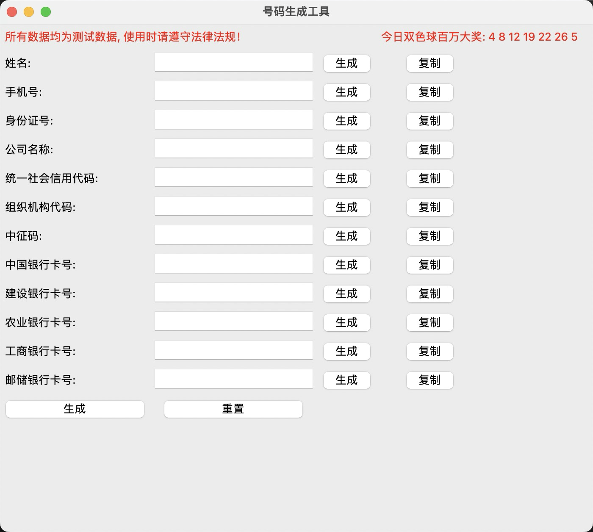

# testdata-generator-tool
测试数据生成

# 效果图展示


# 运行程序
```python
# 直接命令窗口中执行以下命令即可
python main.py
```

# 打包程序
- 安装pyinstaller

    ```python
    pip install pyinstaller
    ```

- Mac打包

    ```python
    pyinstaller -i asserts/ico.icns --name 测试数据生成器 --windowed --clean --noconfirm --onefile --add-data ./asserts:./asserts main.py
    ```

- Windows打包

    ```python
    pyinstaller -i asserts/ico.ico --name 测试数据生成器 --windowed --clean --noconfirm --onefile --add-data "asserts;asserts" main.py
    ```